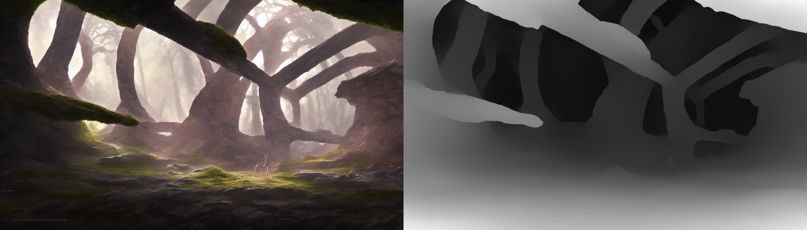

# depthmap-viewer-three

Simple web-based interactive depthmap viewer. Using [threejs](https://threejs.org/) to render a plane with a displacement map.

`Drag-and-drop` images with combined-rgb-and-depth-horizontally into the window to view them.

LIVE at https://thygate.github.io/depthmap-viewer-three

## Example input image


>Image was generated with stable diffusion using [AUTOMATIC1111's Stable Diffusion Web UI](https://github.com/AUTOMATIC1111/stable-diffusion-webui) and [stable-diffusion-webui-depthmap-script](https://github.com/thygate/stable-diffusion-webui-depthmap-script).

## Building
```
npm install
npm run build
```
